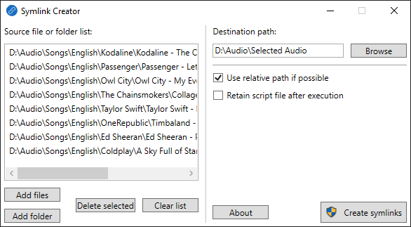

# Symlink Creator
Symlink Creator is a GUI app for creating symbolic links (symlinks), and it is based on [`mklink`](https://learn.microsoft.com/en-us/windows-server/administration/windows-commands/mklink) command. You can create multiple symlinks at a time.

## Walkthrough video

## Use cases
- Suppose, you have a collection of several songs sorted by artists and albums in your PC. You might want a separate collection of your favorite songs which you will store in your mobile devices. In this scenario, the traditional shortcut option through File Explorer right-click context menu is not enough, because you cannot copy the actual file contents by copying the traditional shortcut files (*\*.lnk*). You might consider duplicating the files which you will store in your mobile devices. But it will waste the storage space of your PC. In this case, Symlink Creator will come in handy. You can easily create a separate collection of songs and transfer them to your mobile devices, without wasting your PC's storage space.

- Suppose, you have a special folder that is linked to your online storage like Google Drive. You might want some specific files/folders to be backed up from other folders. A traditional shortcut file is not helpful here to back up those files. In this scenario, you can use Symlink Creator for the backup purpose without duplicating those files/folders in the special folder.

- Suppose, you play video games a lot and you have Steam client to manage those games. You have set a non-system drive (say, *D:*) to download the games. But that non-system drive has slow read capacity but your system drive (say, *C:*) has SSD which is a lot faster to read. In that scenario, you can use Symlink Creator to save your favorite video games in the SSD so that you can load those games faster without changing any settings in Steam client. Symlink Creator can create symlinks of the folders of video games in the slow non-system drive, but the game files are actually stored in the fast SSD.

## What Symlink Creator does
Symlink Creator creates *symlinks* which is an NTFS feature. Unlink the traditional shortcut files (*\*.lnk*), symlinks do not have any *file size*. While symlinks may be called advanced shortcut files, but they appear to be real files. Unlike duplicated files, symlinks do not waste your storage space. Symlink Creator works for both files and folders.

## How Symlink Creator works
Symlink Creator uses `mklink` command to create symlinks. Symlink Creator first creates a script file which contains `mklink` command lines, and executes it. Symlink Creator works in Windows Vista, Windows 7 and Windows 10. It does not work in Windows XP because of the lack of `mklink` command.

## How to use Symlink Creator

- At the `Source file or folder list`, you can add files or folders which will be copied in `Destination path` as symlinks.
- Using Symlink Creator's drag-n-drop feature, you can easily create multiple symlinks at a time.
- Tick `Use relative path if possible` option to use relative paths while creating symlinks. In this case, relative paths will be used if both source files/folders and destination files/folders are in the same drive.
- Tick `Retain script file after execution` option if you want to save the script file for later use like logging purposes.

## Why Symlink Creator needs administrative rights
It has been stated before that Symlink Creator uses `mklink` command to create symlinks. `mklink` command requires administrative privilege to create symlinks. You can find more information [here](https://learn.microsoft.com/en-us/windows/security/threat-protection/security-policy-settings/create-symbolic-links).
