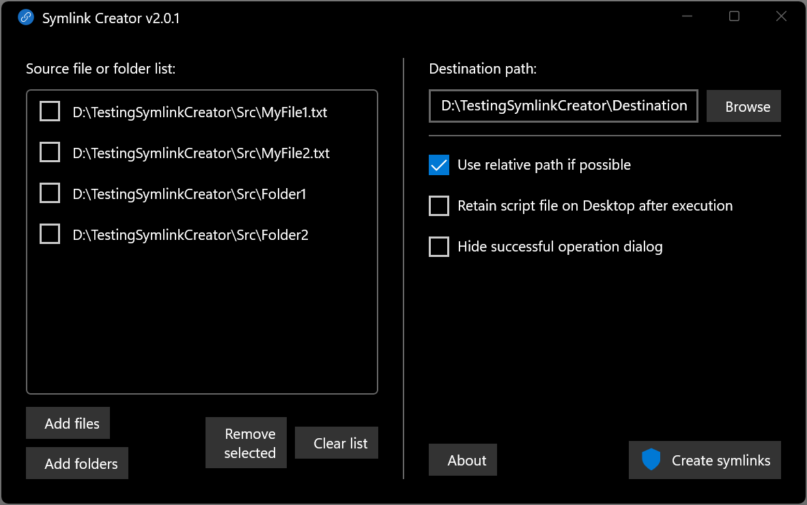

# Symlink Creator

[](https://github.com/arnobpl/SymlinkCreator/actions/workflows/ci.yml)
[](https://dotnet.microsoft.com/)
[](https://github.com/arnobpl/SymlinkCreator/releases/latest)

Symlink Creator is a free, open-source Windows GUI for creating multiple file and folder symbolic links (symlinks) at once. Add multiple existing source paths, choose one destination folder, and let the app create the links for you without writing [`mklink`](https://learn.microsoft.com/en-us/windows-server/administration/windows-commands/mklink) commands or batch scripts by hand.



**Batch workflow:** many sources → one destination folder → one link per source.

## Features

- **Batch symlink creation:** turn multiple source files and folders into links in one destination folder with a single operation.
- **Flexible input:** select files or folders, drag them from File Explorer, or drop text containing one path per line.
- **Target path control:** use relative targets when the source and destination are on the same drive, or use absolute targets when the links must remain independent of the destination's location.
- **Reviewable commands:** optionally retain the generated `.cmd` file on the Desktop for review or troubleshooting.
- **Reusable startup options:** preselect language, theme, path behavior, script retention, and success-dialog behavior from a Windows shortcut.
- **Localized interface:** available in English, Bengali, German, Spanish, French, Japanese, Korean, Brazilian Portuguese, and Simplified Chinese.
- **Modern Windows support:** install through WinGet or download x64 and native ARM64 packages for Windows 10 and Windows 11.
- **Free and open source:** released under the [MIT License](LICENSE).

## Get Symlink Creator

[](https://github.com/microsoft/winget-pkgs/tree/master/manifests/a/ArnobPaul/SymlinkCreator)
[](https://github.com/arnobpl/SymlinkCreator/releases/latest)

### Recommended: Install via WinGet

```powershell
winget install --id ArnobPaul.SymlinkCreator --exact
```

WinGet installs Symlink Creator with its required dependencies and adds a command alias:

```powershell
symlinkcreator
```

### Manual download

📦 [Download for x64](https://github.com/arnobpl/SymlinkCreator/releases/latest/download/Symlink.Creator.x64.zip)

📦 [Download for ARM64](https://github.com/arnobpl/SymlinkCreator/releases/latest/download/Symlink.Creator.arm64.zip)

🗂️ [View all releases](https://github.com/arnobpl/SymlinkCreator/releases)

<details>
<summary><strong>Manual ZIP prerequisites</strong></summary>

Before running the framework-dependent ZIP, install its prerequisites:

```powershell
winget source update
winget install --id Microsoft.DotNet.Runtime.10 --exact --source winget
winget install --id Microsoft.WindowsAppRuntime.2 --exact --source winget
$vcArchitecture = if ([System.Runtime.InteropServices.RuntimeInformation]::OSArchitecture -eq 'Arm64') { 'arm64' } else { 'x64' }
$vcRuntime = "Microsoft.VCRedist.2015+.$vcArchitecture"
winget install --id $vcRuntime --exact --source winget
```

</details>

## New to symbolic links?

A symbolic link is a small filesystem entry that points to a file or folder somewhere else. Most applications can open the link as though the target existed at the link's location. The target's contents are not duplicated, and changes made through the link affect the original target.

| Option | How it behaves | Best suited for |
| --- | --- | --- |
| **Symbolic link** | Appears at a filesystem path and redirects applications to the original file or folder | Making the same content available from another path without duplicating it |
| **Windows shortcut (`.lnk`)** | Opens another item through Windows Shell, but remains a separate shortcut file | Launching files, folders, or applications interactively |
| **Copy** | Creates independent data that consumes additional storage and can diverge from the original | Keeping a separate version that must survive changes to the original |

Deleting a symbolic link removes the link, not its target. Moving or deleting the target breaks the link until its target path is restored. Software such as backup, cloud-sync, and game-management tools may choose whether to follow symbolic links, so verify their behavior before relying on a linked layout.

## Common use cases

- **Organize media in more than one collection.** Keep music or videos in an artist, album, or project structure while building a separate favorites collection from links. The same media stays in one place and does not consume storage twice.

- **Bring scattered content into one working folder.** Make selected files or folders appear together for a media server, development tool, or other application without reorganizing the originals. This is especially convenient when many links need to be created at once.

- **Move game or application data without changing its expected path.** After moving a folder to a faster or larger drive, create a folder symlink in the original parent directory. The application can continue using its familiar path while the data lives on the other drive.

- **Reuse shared development assets.** Keep common configuration, tools, SDKs, or large assets in one location and link them into the project directories where they are expected.

## How Symlink Creator works

For every source path, Symlink Creator plans a link with the same file or folder name inside the selected destination directory. It validates the paths and name collisions first, generates the corresponding `mklink` commands, and then asks Windows for the permission needed to run them. It creates symbolic links only; it does not move, copy, or delete the source content.

## How to use Symlink Creator

1. Add one or more source files or folders:
   - Select them with **Add files** or **Add folders**.
   - Drag them from File Explorer into the source list.
   - Drop text containing one source path per line into the source list.
2. Enter an existing destination directory, or choose one with **Browse**. Symlink Creator creates one link for each source in this directory.
3. Choose the options you need:
   - Use relative paths when the source and destination are on the same drive.
   - Retain the generated command script on the Desktop after execution.
   - Hide the success dialog for unattended or repeated operations.
4. Select **Create symlinks**. Windows may ask for administrator permission.

Example newline-separated input:

```text
D:\TestingSymlinkCreator\Src\MyFile1.txt
D:\TestingSymlinkCreator\Src\MyFile2.txt
```

### Shortcut options

You can append these startup options to a Windows shortcut's target to configure how Symlink Creator behaves when it starts:

- `--no-elevation-warning` prevents the warning about drag-and-drop potentially not working when Symlink Creator is launched as administrator. It does not disable the administrator prompt required to create symlinks.
- `--language <tag>` selects the app language for that launch. Use one of the locale-folder names under [`SymlinkCreator.UI/Strings`](SymlinkCreator.UI/Strings), such as `zh-CN`, `ja-JP`, `pt-BR`, or `ko-KR`. Windows language settings are unchanged.
- `--theme <dark|light>` overrides the Windows theme for that launch. The equals form such as `--theme=dark` is also supported. Omitting the option keeps following the Windows theme.
- `--absolute-paths` makes each symlink point to the source using its complete path, even when a shorter relative path could be used. This keeps the link target independent of the destination folder's location.
- `--retain-script` keeps the generated `.cmd` file on the Desktop after symlink creation. The file contains the Windows commands used by Symlink Creator and can be reviewed for troubleshooting or advanced use.
- `--hide-success-dialog` skips the confirmation dialog after symlink creation succeeds. Error and canceled-operation dialogs are still shown.

For a WinGet installation, first find the command alias path in PowerShell:

```powershell
where.exe symlinkcreator
```

Copy the path that this command returns into the shortcut target, followed by the desired options. For example:

```text
"C:\Users\<username>\AppData\Local\Microsoft\WinGet\Links\symlinkcreator.exe" --language zh-CN --theme dark --absolute-paths --retain-script --hide-success-dialog
```

The three checkbox preferences apply only to that launch and can still be changed using the checkboxes. Theme selection, language selection, and elevation-warning suppression are startup-only options.

## Administrative rights

Windows controls symbolic link creation through the **Create symbolic links** user right. Symlink Creator runs its generated `mklink` script with elevated permissions, so Windows may prompt for administrator permission when creating links. If the app is running as administrator, File Explorer may prevent drag-and-drop. Run it without elevation when you need to drag paths into the app. See the [Windows security policy documentation](https://learn.microsoft.com/en-us/windows/security/threat-protection/security-policy-settings/create-symbolic-links) for details.

## Development

Build, test, and release instructions are available in the [development and release guide](docs/Development.md).

## License

Symlink Creator is available under the [MIT License](LICENSE).

## Support Symlink Creator

Symlink Creator is a simple tool, but if it has saved you time or made things a bit easier, consider supporting the project. Every contribution helps keep it going and encourages future improvements.

<a href='https://ko-fi.com/O4O01L2D7P' target='_blank'></a>

You can donate via [PayPal](https://paypal.me/arnobpl).


You can also send crypto tokens to the following addresses:

<table>
  <thead>
    <tr>
      <th>Blockchain</th>
      <th>QR Code and Address</th>
    </tr>
  </thead>
  <tbody>
    <tr>
      <td>Ethereum</td>
      <td>
        <br>
        <code>0x2536B9A9a6b49234db2006482f43d02BEE6FDd07</code>
      </td>
    </tr>
    <tr>
      <td>Bitcoin</td>
      <td>
        <br>
        <code>bc1qwhwqal63y629ltnyhvr0txl5xngnhh9dv9u5yf</code>
      </td>
    </tr>
  </tbody>
</table>

If donating is not an option, simply starring the repo, sharing feedback, or spreading the word is equally appreciated. Thank you for using Symlink Creator and sharing your thoughts.

Happy Symlinking!
