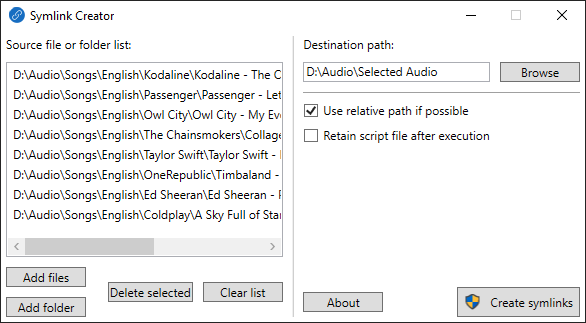

# Symlink Creator（符号链接创建器）

Symlink Creator 是一款用于创建符号链接（symlink）的图形界面应用，基于 [`mklink`](https://learn.microsoft.com/zh-cn/windows-server/administration/windows-commands/mklink) 命令实现。你可以一次性创建多个符号链接。

## 获取 Symlink Creator

[](https://github.com/microsoft/winget-pkgs/tree/master/manifests/a/ArnobPaul/SymlinkCreator)
[](https://github.com/arnobpl/SymlinkCreator/releases/latest/download/Symlink.Creator.zip)

两种方式都无需安装向导，即开即用。

### 推荐：通过 WinGet 安装

```powershell
winget install --id ArnobPaul.SymlinkCreator --exact
```

WinGet 还会添加一个命令别名：

```powershell
symlinkcreator
```

### 手动下载

📥 [下载 Symlink.Creator.zip](https://github.com/arnobpl/SymlinkCreator/releases/latest/download/Symlink.Creator.zip)

📦 [查看全部版本](https://github.com/arnobpl/SymlinkCreator/releases)

## 使用场景

- 假设你的电脑上有一批按歌手和专辑分类整理的歌曲，而你希望另建一个包含所有最爱歌曲的收藏夹，以便复制到移动设备上。这时，通过文件资源管理器右键菜单创建的传统快捷方式（`*.lnk`）无法满足需求，因为复制传统快捷方式文件无法获得真实的文件内容。你可能会想到复制这些文件，但这样会浪费电脑的存储空间。此时 Symlink Creator 就能派上用场：你可以轻松创建一个单独的歌曲收藏文件夹，并将其传输到移动设备，而不会浪费电脑的存储空间。

- 假设你有一个与 Google Drive 等在线存储关联的专用文件夹，希望把其他文件夹中的某些特定文件/文件夹备份进去。传统的快捷方式文件无法帮你完成备份。此时你可以使用 Symlink Creator 进行备份，而无需在专用文件夹中复制这些文件/文件夹。

- 假设你经常玩游戏，并使用 Steam 客户端管理游戏。你把游戏下载目录设置到了非系统盘（例如 *D:*），但该非系统盘读取速度较慢，而你的系统盘（例如 *C:*）是读取速度更快的 SSD。此时，你可以用 Symlink Creator 把最爱的游戏保存到 SSD 中，无需在 Steam 客户端里更改任何设置，就能让游戏加载得更快。Symlink Creator 可以把慢速非系统盘中的游戏文件夹创建为符号链接，而游戏文件实际存储在高速 SSD 上。

## Symlink Creator 能做什么

Symlink Creator 创建的是 NTFS 特性中的 *符号链接*。与传统快捷方式文件（`*.lnk`）不同，符号链接*不占文件大小*。虽然符号链接可以称为“高级快捷方式”，但它们看起来就像真实文件。与复制文件不同，符号链接不会浪费存储空间。Symlink Creator 对文件和文件夹都适用。

## Symlink Creator 的工作原理

- Symlink Creator 通过生成并执行脚本来使用 `mklink` 命令创建符号链接。
- 适用于 Windows 11/10。
- 在 1.3.0 版本之前，它还支持 Windows 8.1/8、Windows 7 和 Windows Vista。由于 Symlink Creator v1.3.0 引入的 [`longPathAware`](https://learn.microsoft.com/zh-cn/windows/win32/fileio/maximum-file-path-limitation?tabs=registry#enable-long-paths-in-windows-10-version-1607-and-later)（长路径支持）特性不受更早的 Windows 版本支持，因此后续版本不再支持这些系统。
- 由于没有 `mklink` 命令，它不支持 Windows XP。

## 如何使用 Symlink Creator



- 在 `源文件或文件夹列表` 中，你可以添加要作为符号链接复制到 `目标路径` 的文件或文件夹。
- 借助 Symlink Creator 的拖放功能，你可以轻松地一次性创建多个符号链接。
  - 可以直接从文件资源管理器中拖放文件/文件夹。
  - 也可以拖放包含以换行分隔的文件/文件夹路径列表的文本，例如：
  ```
  D:\TestingSymlinkCreator/Src/MyFile1.txt
  D:\TestingSymlinkCreator/Src/MyFile2.txt
  ```
- 勾选 `尽可能使用相对路径` 可让创建符号链接时使用相对路径。当源文件/文件夹与目标文件/文件夹位于同一驱动器时，将使用相对路径。
- 勾选 `执行后保留脚本文件` 可保存脚本文件，供以后使用（如日志记录或其他高级用途）。
- 勾选 `隐藏成功操作对话框` 可只在出错时显示对话框。

## 为什么 Symlink Creator 需要管理员权限

前面已经提到，Symlink Creator 使用 `mklink` 命令创建符号链接。`mklink` 命令需要管理员权限才能创建符号链接。更多信息请参阅[这里](https://learn.microsoft.com/zh-cn/windows/security/threat-protection/security-policy-settings/create-symbolic-links)。

## 支持 Symlink Creator

Symlink Creator 是一个简单的工具，但如果它为你节省了时间或让事情变得更轻松，不妨考虑支持这个项目。每一份贡献都会帮助项目持续发展，并鼓励未来的改进。

<a href='https://ko-fi.com/O4O01L2D7P' target='_blank'></a>

你也可以通过 [PayPal](https://paypal.me/arnobpl) 捐款。


你还可以向以下地址发送加密货币：

<table>
  <thead>
    <tr>
      <th>区块链</th>
      <th>二维码与地址</th>
    </tr>
  </thead>
  <tbody>
    <tr>
      <td>Ethereum</td>
      <td>
        <br>
        <code>0x2536B9A9a6b49234db2006482f43d02BEE6FDd07</code>
      </td>
    </tr>
    <tr>
      <td>Bitcoin</td>
      <td>
        <br>
        <code>bc1qwhwqal63y629ltnyhvr0txl5xngnhh9dv9u5yf</code>
      </td>
    </tr>
  </tbody>
</table>

如果无法捐款，给仓库点个 Star、分享反馈或帮忙宣传同样值得感谢。感谢你使用 Symlink Creator 并分享你的想法。

祝符号链接愉快！
